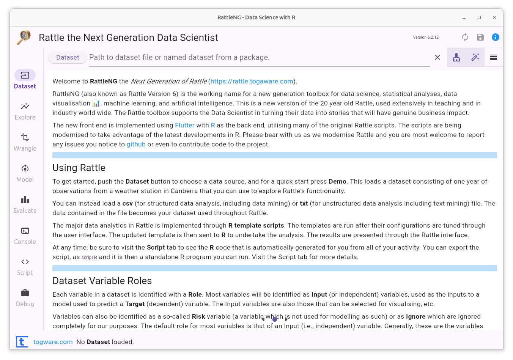
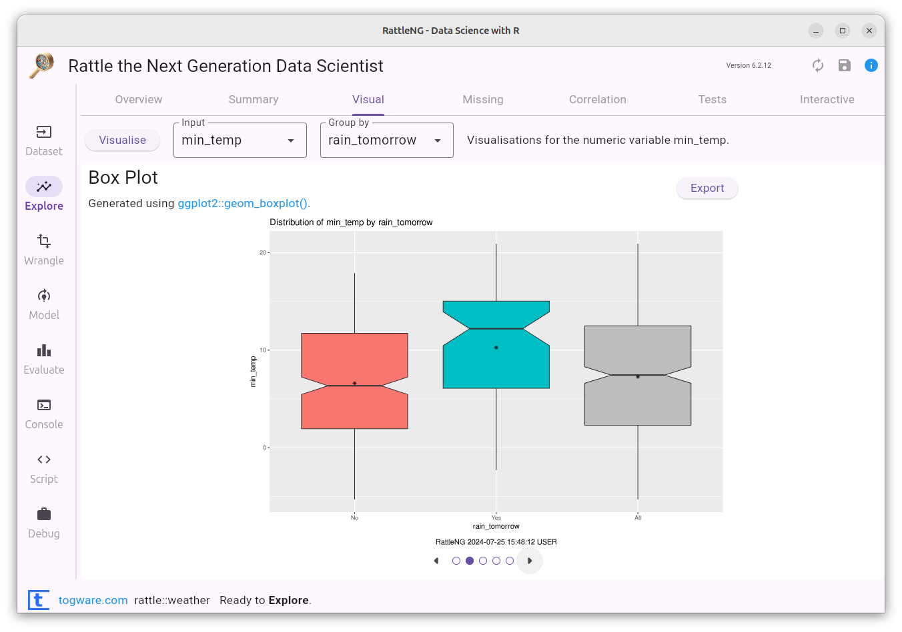
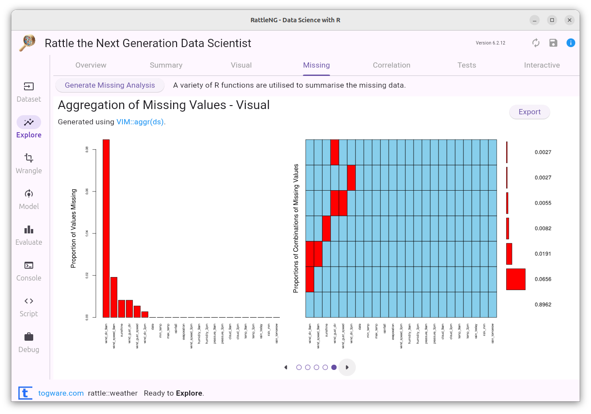
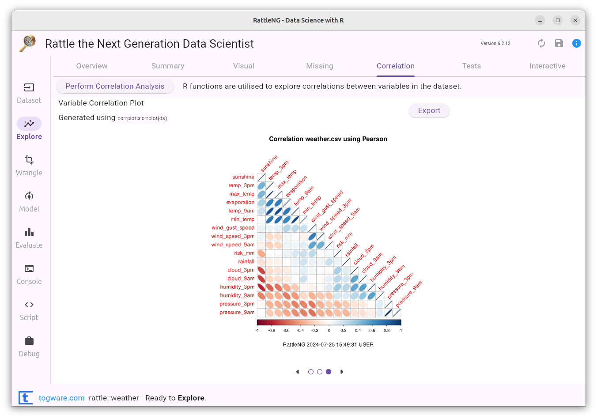
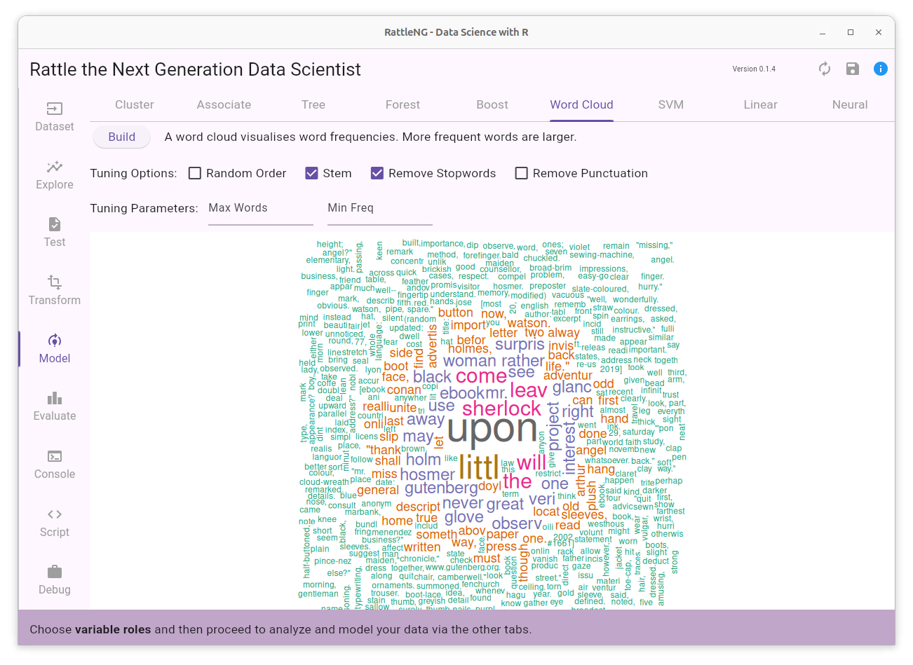
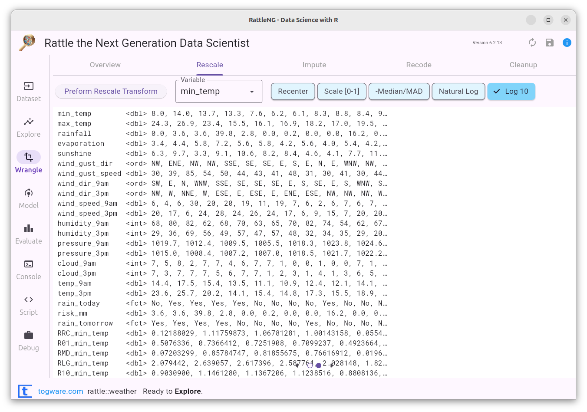
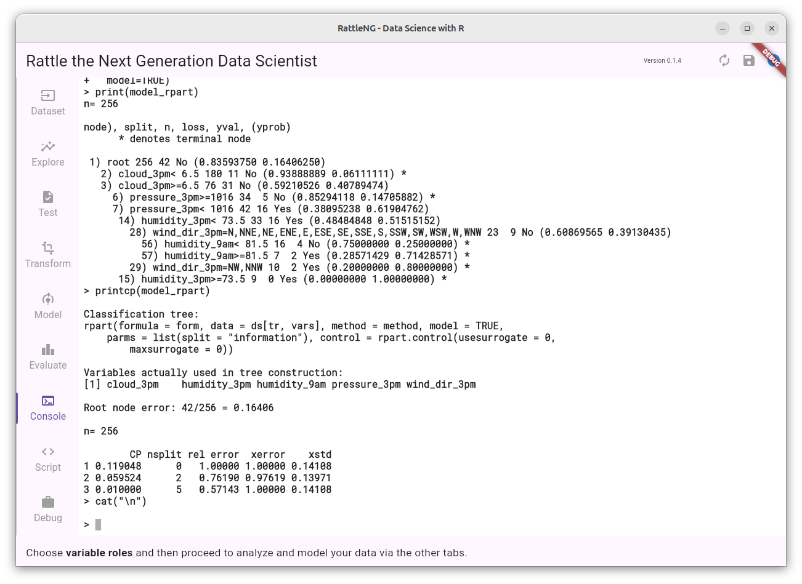

[](https://flutter.dev)
[](https://dart.dev)
[](https://www.r-project.org/)

[](https://github.com/gjwgit/rattleng/commits/dev/)
[](https://github.com/gjwgit/rattleng/blob/dev/CHANGELOG.md)
[](https://github.com/gjwgit/rattleng/issues)
[](https://raw.githubusercontent.com/gjwgit/rattleng/main/LICENSE)
[](https://github.com/gjwgit/rattle/commits/dev/)

# Rattle the Next Generation Data Scientist

[Rattle](https://rattle.togaware.com) has been in development and use
for almost 20 years as a Data Mining and now Data Science toolkit for
the apprentice and practising Data Scientist. The open source software
and it books and papers have been used by educators, consultants, and
practitioners across industry and government, to turn data into
knowledge, through machine learning and artificial intelligence.

But now, it is time for a refresh. To install the new Rattle visit the
[Installers](https://github.com/gjwgit/rattleng/tree/dev/installers/README.md).

RattleNG, available from [github](https://github.com/gjwgit/rattleng),
remains sympathetic to the original Rattle user interface,
functionality, and goals, as presented in the
[Rattle](https://bit.ly/rattle_data_mining) book. However, it brings
to the community a modern user interface refresh implemented in
**Flutter**. The underlying **R** foundations remain firmly in place
and encapsulated within a more readily extensible framework. A new
edition of the Rattle book will soon be available.

Over the past 15 years we have also matured in how we deliver data
science and analytics. RattleNG delivers a new perspective on
scripting data science in R through templates as introduced in my more
recent book, *The Essentials of Data Science*
(https://bit.ly/essentials_data_science). The concept of templates for
data science now provides the foundations for a flexible and
extensible application in RattleNG.

You can also review my Desktop Data Mining Survival Guide published
online by Togaware, available from (https://datamining.togaware.com).

The detailed coding documentation for our new Flutter/Dart based
RattleNG is available online from the [Solid Community
AU](https://solidcommunity.au/docs/rattleng/).

The RattleNG rewrite is being lead by Professor Graham Williams (the
original Rattle author), Chief Scientist of the Software Innovation
Institute of the Australian National University.  Significant
contributions have also been made by Yixiang Yin.

## Quick Start and Current Status 2024-07-07

You will need to install R, separate to the  app itself. Visit
https://www.r-project.org/ for details.

Then install RattleNG for your operating system as detailed in the
installers
[README](https://github.com/gjwgit/rattleng/blob/dev/installers/README.md).

Then:

+ Start RattleNG.
+ Tap the **Script** tab to see the R code that has been run.
+ Tap the **Console** tab to see the R code being run within an R
  session. You can even type R commands there to have them run.
+ Tap the **Dataset** tab to return the to the startup screen for
  RattleNG. Tap the **Dataset** button and then choose **Demo** to
  load the `rattle::weather` dataset. You can also load your own CSV
  or TXT file by tapping the **Filename** button instead. The result
  panel of the page will provide view or summary of the dataset.
+ Tap the right pointing arrow to view the **Roles** page where you
  can specify the role for each variable. Defaults will have been set.
+ Notice the toggle buttons to the top right of the **Dataset** page:
  **Cleanse**, **Normalise** and **Partition**. Hover the mouse to
  view the tooltips.
+ To build an AI model, tap the **Model** tab and then the **Tree**
  radio button (selected by default) and then the **Build** button to
  build and view a decision tree from a CSV dataset. Scroll through
  the pages to the page showing the decision tree, textually and
  visually.
+ Tap the **Script** tab and scroll the window to view the latest R
  commands run. Then tap the **Export** button to save the full script
  to `script.R` (no options currently to change the name or location
  of the saved script file).
+ From your own command line run `Rscript script.R`

Currently implemented features as of version 6.3.9 (2024-10-18):

+ Dataset
  + Demo
  + CSV
  + TXT
  + Roles
+ Explore
  + Summary
  + Visual
  + Missing
  + Correlation
  + Tests
+ Transform
  + Impute
  + Rescale
  + Recode
  + Cleanup
+ Model
  + Cluster
  + Neural
  + Tree
  + Forest
  + Boost
  + Word Cloud
+ Console
+ Script

## Building RattleNG from Source

Ensure you have R installed, as described in the installer
[README](https://github.com/gjwgit/rattleng/blob/dev/installers/README.md).

Install Flutter as describe in the [Flutter Install
Guide](https://docs.flutter.dev/get-started/install). In short, to
install on Windows, download the flutter sdk, unzip it to your home
folder, add `C:\Users\<user>\flutter\bin` to the PATH environment
variable, and in a CMD console run `flutter help`.

*Currently (20230918), on Azure Windows VM, `flutter doctor` just sits
there!*

Then clone the [rattleng](https://github.com/gjwgit/rattleng)
repository:

```bash
git clone https://github.com/gjwgit/rattleng
cd rattleng
flutter run
```

Choose your target platform when prompted.

After firing up the rattleng app, check in the **Console** tab to make
sure R is running. You should see some R code and the console is
waiting at the R prompt:

```r
...
>
```

RattleNG will itself eventually check for these and prompt if they are
not available.

### Latest Code

RattleNG is currently under active development. To get the current app
you can install flutter on your local computer, then clone the github
repository, to your local disk, and from a command line change to the
directory where you cloned the rattle repository (it should contain a
`lib` sub-directory) and type the following command, changing `<os>`
to be one of `windows`, `macos`, or `linux`.

```
flutter run -d <os>
```

## How you can Help

RattleNG will remain an open source application, free for anyone to
use in any way they like. Contributions are welcome and the simplest
is to make them through pull requests on github. You can fork my
repository, make your changes, and push them back as a pull request to
my repository where I can review and merge into the main product.

There is plenty to do, and if you have a favourite feature of Rattle,
consider either implementing the GUI in Flutter for that component, or
else write a simple template R script that takes a dataset `ds` and
any other template parameters (as ``<<PARAMETER>>`` in the script) to
then do it's stuff! The `<<PARAMETER>>` strings are filled in by the
Flutter interface. See the growing number of scripts in
`assets/scripts/`

Suggested tasks can be found as github issues.

## Rattle Resources

+ Bob Meunchen's review of Rattle: https://r4stats.com/articles/software-reviews/rattle/

## Some RattleNG teasers

### Rattle's 5 Click to Your First AI Model

The traditional Rattle Welcome screen provides an overview of
Rattle. To build your first model, simply click the **Dataset** button
to choose **Demo**, which will load the `rattle::weather`
dataset. Then click the **Model** tab and the **Tree** feature to then
**Build** your first decision tree (an AI model).



Click the **Dataset** button to have options to load the data from a
file, from an R package, or the demo weather dataset.


After the data is loaded we are presented with a summary.


### Exploring Data Visually

All of the popular Rattle visualisations are available, modernised
using `ggplot` and the `tidyverse`.



The traditional missing data plots have been updated:



The correlation plot removes repeated information from the plot:



### Summarising Through WordClouds

For a text file we can gain an insight into the document through a
word cloud.



### Wrangling the Data

A suite of transformation functions are available in Rattle to map
variables in different ways. Each transformation will create a new
variable from the old variable. Here we see `min_temp` being
transformed using the RECENTER feature and each of the transform
functions available. The new variables are prefixed with an indicator
of the type of transformation performed.



### Building Models

A decision tree model is one of the most widely built AI models.


Visualisations are now built and presented by default, compared to
Rattle of Old.


### The R Console

The R console is where everything in R happens. The user can review
the contents of the console and even run R commands themselves. Click
the **Export** button to have the history of R commands from the
console saved to file. Compare this **Export** to that of the
**Script** page where a documented and formatted script is saved to
file.



### Everything Captured as Scripts

And be assured, the most important of functionalities, the **Script**
tab's capturing of your interactions, remains a key feature of
Rattle. All of your interactions with R through Rattle are
captured as a documented and nicely formatted script that you can save
to file and replicate your whole project simply by asking R to run the
script. It is also he starting point for modifying a script to do
precisely what you want, beyond what Rattle supports. No lock-in.


